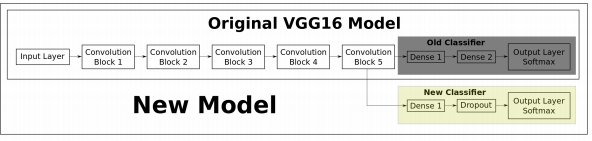

# pubnbtest-music

# Abstract

Categorizing music files according to their genre is a challenging task in the area of music information retrieval (MIR). In this study, we compare the performance of two classes of models. The first is a deep learning approach wherein a CNN model is trained end-to-end, to predict the genre label of an audio signal, solely using its spectrogram. The second approach utilizes hand-crafted features, both from the time domain and frequency domain. We train four traditional machine learning classifiers with these features and compare their performance. The features that contribute the most towards this classification task are identified. The experiments are conducted on the Audio set data set and we report an AUC value of 0.894 for an ensemble classifier which combines the two proposed approaches.

# 1 Introduction

With the growth of online music databases and easy access to music content, people find it increasing hard to manage the songs that they listen to. One way to categorize and organize songs is based on the genre, which is identified by
some characteristics of the music such as rhythmic structure, harmonic content and instrumentation (Tzanetakis and Cook, 2002). Being able to automatically classify and provide tags to the music present in a user’s library, based on genre,
would be beneficial for audio streaming services such as Spotify and iTunes. This study explores the application of machine learning (ML) algorithms to identify and classify the genre of a given audio file. The first model described in this paper uses convolutional neural networks (Krizhevsky et al., 2012), which is trained end-to-end on the MEL spectrogram of the audio signal. In the second part of the study, we extract features both in the time domain and the frequency domain of the audio signal. These features are then fed to conventional machine learning models namely Logistic Regression, Random Forests (Breiman, 2001), Gradient Boosting (Friedman, 2001) and Support Vector Machines which are trained to classify the given audio file. The models are evaluated on the Audio Set dataset (Gemmeke et al., 2017). We compare the proposed models and also study the relative importance of different features. 

The rest of this paper is organized as follows. Section 2 describes the existing methods in the literature for the task of music genre classification. Section 3 is an overview of the the dataset used in this study and how it was obtained. The proposed models and the implementation details are discussed in Section 4. The results are reported in Section 5.2, followed by the conclusions from this study in Section 6.

# 2 Literature Review

Music genre classification has been a widely studied area of research since the early days of the Internet. Tzanetakis and Cook (2002) addressed this problem with supervised machine learning approaches such as Gaussian Mixture model and knearest neighbour classifiers. They introduced 3 sets of features for this task categorized as timbral structure, rhythmic content and pitch content. Hidden Markov Models (HMMs), which have been extensively used for speech recognition tasks, have also been explored for music genre classification (Scaringella and Zoia, 2005; Soltau et al., 1998). Support vector machines (SVMs) arXiv:1804.01149v1 [cs.SD] 3 Apr 2018 with different distance metrics are studied and compared in Mandel and Ellis (2005) for classifying genre.

In Lidy and Rauber (2005), the authors discuss the contribution of psycho-acoustic features for recognizing music genre, especially the importance of STFT taken on the Bark Scale (Zwicker and Fastl, 1999). Mel-frequency cepstral coefficients (MFCCs), spectral contrast and spectral roll-off were some of the features used by (Tzanetakis and Cook, 2002). A combination of visual and acoustic features are used to train SVM and AdaBoost classifiers in Nanni et al. (2016).

With the recent success of deep neural networks, a number of studies apply these techniques to speech and other forms of audio data (AbdelHamid et al., 2014; Gemmeke et al., 2017). Representing audio in the time domain for input to neural networks is not very straight-forward because of the high sampling rate of audio signals. However, it has been addressed in Van Den Oord et al. (2016) for audio generation tasks. A common alternative representation is the spectrogram
of a signal which captures both time and frequency information. Spectrograms can be considered as images and used to train convolutional neural networks (CNNs) (Wyse, 2017). A CNN was developed to predict the music genre using the raw
MFCC matrix as input in Li et al. (2010). In Lidy and Schindler (2016), a constant Q-transform (CQT) spectrogram was provided as input to the CNN to achieve the same task. This work aims to provide a comparative study between 1) the deep learning based models which only require the spectrogram as input and, 2) the traditional machine learning classifiers that need to be trained with hand-crafted features. We also investigate the relative importance of different features.

# 3 Dataset

In this work, we make use of Audio Set, which is a large-scale human annotated database of sounds (Gemmeke et al., 2017). The dataset was created by extracting 10-second sound clips from a total of 2.1 million YouTube videos. The audio files have been annotated on the basis of an ontology which covers 527 classes of sounds including musical instruments, speech, vehicle sounds, animal sounds and so on. 

This study requires only the audio files that belong to the music category, specifically having one of the seven genre tags shown in Table 1.


```
import re
import os
from tqdm import tqdm
import pandas as pd
import numpy as np
```

```
WAV_DIR = 'wav_files/'
genre_dict = {
            '/m/064t9': 'Pop_music',
            '/m/0glt670': 'Hip_hop_music',
            '/m/06by7': 'Rock_music',
            '/m/06j6l': 'Rhythm_blues',
            '/m/06cqb': 'Reggae',
            '/m/0y4f8': 'Vocal',
            '/m/07gxw': 'Techno',
            }

genre_set = set(genre_dict.keys())
```

```
temp_str = []
with open('data-files/csv_files/unbalanced_train_segments.csv', 'r') as f:
    temp_str = f.readlines()
```

```
data = np.ones(shape=(1,4)) 
for line in tqdm(temp_str):
    line = re.sub('\s?"', '', line.strip())
    elements = line.split(',')
    common_elements = list(genre_set.intersection(elements[3:]))
    if  common_elements != []:
        data = np.vstack([data, np.array(elements[:3]
                                         + [genre_dict[common_elements[0]]]).reshape(1, 4)])

df = pd.DataFrame(data[1:], columns=['url', 'start_time', 'end_time', 'class_label'])
```

```
df['class_label'].value_counts()
```

```
# Remove 10k Techno audio clips - to make the data more balanced
np.random.seed(10)
drop_indices = np.random.choice(df[df['class_label'] == 'Techno'].index, size=10000, replace=False)
df.drop(labels=drop_indices, axis=0, inplace=True)
df.reset_index(drop=True, inplace=False)

# Time to INT 
df['start_time'] = df['start_time'].map(lambda x: np.int32(np.float(x)))
df['end_time'] = df['end_time'].map(lambda x: np.int32(np.float(x)))
```

```
df['class_label'].value_counts()
```

The number of audio clips in each category has also been tabulated. The raw audio clips of these sounds have not been provided in the Audio Set data release. However, the data provides the YouTubeID of the corresponding videos, along with the start and end times. Hence, the first task is to retrieve these audio files. For the purpose of audio retrieval from YouTube, the following steps were carried out:

Example:<br>
Step 1:<br>
`ffmpeg -ss 5 -i $(youtube-dl -f 140 --get-url 'https://www.youtube.com/embed/---1_cCGK4M') -t 10 -c:v copy -c:a copy test.mp4`<br>
Starting time is 5 seconds, duration is 10s.

Refer: https://github.com/rg3/youtube-dl/issues/622

Step 2:<br>
`ffmpeg -i test.mp4 -vn -acodec pcm_s16le -ar 44100 -ac 1 output.wav` <br>
PCM-16, 44k sampling, 1-channel (Mono)
<br>
Refer: https://superuser.com/questions/609740/extracting-wav-from-mp4-while-preserving-the-highest-possible-quality

```
import youtube_dl
for i, row in tqdm(df.iterrows()):
    url = "'https://www.youtube.com/embed/" + row['url'] + "'"
    file_name = str(i)+"_"+row['class_label']
    
    try:
        command_1 = "ffmpeg -ss " + str(row['start_time']) + " -i $(youtube-dl -f 140 --get-url " +\
                    url + ") -t 10 -c:v copy -c:a copy " + file_name + ".mp4"

        command_2 = "ffmpeg -i "+ file_name +".mp4 -vn -acodec pcm_s16le -ar 44100 -ac 1 " + WAV_DIR + file_name + ".wav"

        command_3 = 'rm ' + file_name + '.mp4' 

        # Run the 3 commands
        os.system(command_1 + ';' + command_2 + ';' + command_3 + ';')
    
    except:
        print(i, url)
        pass
```

Each wav file is about 880 KB in size, which means that the total data used in this study is approximately 34 GB.

# 4 Methodology

This section provides the details of the data preprocessing steps followed by the description of the two proposed approaches to this classification problem.

## 4.1 Data Pre-processing 

In order to improve the Signal-to-Noise Ratio (SNR) of the signal, a pre-emphasis filter, given by Equation 1 is applied to the original audio signal.

y(t) = x(t) − α ∗ x(t − 1)

where, x(t) refers to the original signal, and y(t) refers to the filtered signal and α is set to 0.97. Such a pre-emphasis filter is useful to boost amplitudes at high frequencies (Kim and Stern, 2012).

## 4.2 Deep Neural Networks

Using deep learning, we can achieve the task of music genre classification without the need for hand-crafted features. Convolutional neural networks (CNNs) have been widely used for the task of image classification (Krizhevsky et al., 2012). The 3-channel (RGB) matrix representation of an image is fed into a CNN which is trained to predict the image class. In this study, the sound wave can be represented as a spectrogram, which in turn can be treated as an image (Nanni et al., 2016)(Lidy and Schindler, 2016). The task of the CNN is to use the spectrogram to predict the genre label (one of seven classes).

### 4.2.1 Spectrogram Generation

A spectrogram is a 2D representation of a signal, having time on the x-axis and frequency on the y-axis. A colormap is used to quantify the magnitude of a given frequency within a given time window. In this study, each audio signal was converted into a MEL spectrogram (having MEL frequency bins on the y-axis). The parameters used to generate the power spectrogram using STFT are listed below:

- Sampling rate (sr) = 22050
- Frame/Window size (n fft) = 2048
- Time advance between frames (hop size) = 512 (resulting in 75% overlap)
- Window Function: Hann Window
- Frequency Scale: MEL
- Number of MEL bins: 96
- Highest Frequency (f max) = sr/2

```
import os

import matplotlib
matplotlib.use('agg')

from matplotlib import pyplot as plt
from matplotlib import cm
from tqdm import tqdm
import pylab

import librosa
from librosa import display
import numpy as np

WAV_DIR = 'wav_files/'
IMG_DIR = 'spectrogram_images/'
wav_files = os.listdir(WAV_DIR)

for f in tqdm(wav_files):
    try:
        # Read wav-file
        y, sr = librosa.load(WAV_DIR+f, sr = 22050) # Use the default sampling rate of 22,050 Hz
        
        # Pre-emphasis filter
        pre_emphasis = 0.97
        y = np.append(y[0], y[1:] - pre_emphasis * y[:-1])
        
        # Compute spectrogram
        M = librosa.feature.melspectrogram(y, sr, 
                                           fmax = sr/2, # Maximum frequency to be used on the on the MEL scale
                                           n_fft=2048, 
                                           hop_length=512, 
                                           n_mels = 96, # As per the Google Large-scale audio CNN paper
                                           power = 2) # Power = 2 refers to squared amplitude
        
        # Power in DB
        log_power = librosa.power_to_db(M, ref=np.max)# Covert to dB (log) scale
        
        # Plotting the spectrogram and save as JPG without axes (just the image)
        pylab.figure(figsize=(3,3))
        pylab.axis('off') 
        pylab.axes([0., 0., 1., 1.], frameon=False, xticks=[], yticks=[]) # Remove the white edge
        librosa.display.specshow(log_power, cmap=cm.jet)
        pylab.savefig(IMG_DIR + f[:-4]+'.jpg', bbox_inches=None, pad_inches=0)
        pylab.close()

    except Exception as e:
        print(f, e)
        pass
```

### 4.2.2 Convolutional Neural Networks

From the Figure 1, one can understand that there exists some characteristic patterns in the spectrograms of the audio signals belonging to different classes. Hence, spectrograms can be considered as ’images’ and provided as input to a CNN, which has shown good performance on image classification tasks. Each block in a CNN consists of the following operations

- **Convolution**: This step involves sliding a matrix filter (say 3x3 size) over the input image which is of dimension image width x image height. The filter is first placed on the image matrix and then we compute an element-wise multiplication between the filter and the overlapping portion of the image, followed by a summation to give a feature value. We use many such filters , the values of which are ’learned’ during the training of the neural network via backpropagation.

- **Pooling**: This is a way to reduce the dimension of the feature map obtained from the convolution step, formally know as the process of down sampling. For example, by max pooling with 2x2 window size, we only retain the element with the maximum value among the 4 elements of the feature map that are covered in this window. We keep moving this window across the feature map with a predefined stride.

- **Non-linear Activation**: The convolution operation is linear and in order to make the neural network more powerful, we need to introduce some non-linearity. For this purpose, we can apply an activation function such as ReLU4 on each element of the feature map.

In this study, a CNN architecture known as VGG-16, which was the top performing model in the ImageNet Challenge 2014 (classification + localization task) was used (Simonyan and Zisserman, 2014). The model consists of 5 convolutional blocks (conv base), followed by a set of densely connected layers, which outputs the probability that a given image belongs to each of the possible classes

For the task of music genre classification using spectrograms, we download the model architecture with pre-trained weights, and extract the conv base. The output of the conv base is then send to a new feed-forward neural network which in turn predicts the genre of the music, as depicted in Figure 2.



There are two possible settings while implementing the pre-trained model: 

1. Transfer learning: The weights in the conv base are kept fixed but the weights in the feed-forward network (represented by the yellow box in Figure 2) are allowed to be tuned to predict the correct genre label. 

2. Fine tuning: In this setting, we start with the pre-trained weights of VGG-16, but allow all the model weights to be tuned during training process.

The final layer of the neural network outputs the class probabilities (using the softmax activation function) for each of the seven possible class labels. Next, the cross-entropy loss is computed as follows: 

L = − X M c=1 yo,c ∗ log po,c (2) 

where, M is the number of classes; yo,c is a binary indicator whose value is 1 if observation o belongs to class c and 0 otherwise; po,c is the model’s predicted probability that observation o belongs to class c. This loss is used to backpropagate the error, compute the gradients and thereby update the weights of the network. This iterative process continues until the loss converges to a minimum value.

### 4.2.3 Implementation Details

The spectrogram images have a dimension of 216 x 216. For the feed-forward network connected to the conv base, a 512-unit hidden layer is implemented. Over-fitting is a common issue in neural networks. In order to prevent this, two strategies are adopted:

1. L2-Regularization (Ng, 2004): The loss function of the neural network is added with the term 1 2 λ P i wi 2 , where w refers to the weights in the neural networks. This method is used to penalize excessively high weights. We would like the weights to be diffused across all model parameters, and not just among a few parameters. Also, intuitively, smaller weights would correspond to a less complex model, thereby avoiding overfitting. λ is set to a value of 0.001 in this study. 

2. Dropout (Srivastava et al., 2014): This is a regularization mechanism in which we shutoff some of the neurons (set their weights to zero) randomly during training. In each iteration, we thereby use a different combination of neurons to predict the final output. This makes the model generalize without any heavy dependence on a subset of the neurons. A dropout rate of 0.3 is used, which means that a given weight is set to zero during an iteration, with a probability of 0.3.

The dataset is randomly split into train (90%), validation (5%) and test (5%) sets. The same split is used for all experiments to ensure a fair comparison of the proposed models.

The neural networks are implemented in Python using Tensorflow 5 ; an NVIDIA Titan X GPU was utilized for faster processing. All models were trained for 10 epochs with a batch size of 32 with the ADAM optimizer (Kingma and Ba, 2014). One epoch refers to one iteration over the entire training dataset.

Figure 3 shows the learning curves - the loss (which is being optimized) keeps decreasing as the training progresses. Although the training accuracy keeps increasing, the validation accuracy first increases and after a certain number of epochs, it starts to decrease. This shows the model’s tendency to overfit on the training data. The model that is selected for evaluation purposes is the one that has the highest accuracy and lowest loss on the validation set (epoch 4 in Figure 3).

### 4.2.4 Baseline Feed-forward Neural Network

To assess the performance improvement that can be achived by the CNNs, we also train a baseline feed-forward neural network that takes as input the same spectrogram image. The image which is a 2-dimensional vector of pixel values is unwrapped or flattened into a 1-dimensional vector. Using this vector, a simple 2-layer neural network is trained to predict the genre of the audio signal. The first hidden layer consists of 512 units and the second layer has 32 units, followed by the output layer. The activation function used is ReLU and the same regularization techniques described in Section 4.2.3 are adopted.

```
import os

os.environ["CUDA_DEVICE_ORDER"]="PCI_BUS_ID"
os.environ["CUDA_VISIBLE_DEVICES"]="1"

import tensorflow as tf

config = tf.ConfigProto()
config.gpu_options.allow_growth=True

sess = tf.Session(config=config)

import numpy as np
import pandas as pd
import pickle
from matplotlib import pyplot as plt
from PIL import Image
from IPython.display import Audio
from matplotlib.pyplot import imshow
from sklearn.model_selection import train_test_split
from sklearn.preprocessing import OneHotEncoder
from sklearn.utils.class_weight import compute_class_weight

from tensorflow.contrib.keras import layers
from tensorflow.contrib.keras import models
from tensorflow.contrib.keras import layers
from tensorflow.contrib.keras import optimizers
from tensorflow.contrib.keras import callbacks
from tensorflow.contrib.keras import regularizers
from tensorflow.contrib.keras import models

%matplotlib inline
```

```
IMG_DIR = 'spectrogram_images/'
IMG_HEIGHT = 216
IMG_WIDTH = 216
NUM_CLASSES = 7
NUM_EPOCHS = 10
BATCH_SIZE = 32
L2_LAMBDA = 0.001
```

```
label_dict = {'Hip':0,
              'Pop':1,
              'Vocal':2,
              'Rhythm':3,
              'Reggae':4,
              'Rock':5,
              'Techno':6,
             }
one_hot = OneHotEncoder(n_values=NUM_CLASSES)

all_files = os.listdir(IMG_DIR)

# Get class weights
label_array = []
for file_ in all_files:
    vals = file_[:-4].split('_')
    label_array.append(label_dict[vals[1]])
    
cl_weight = compute_class_weight(class_weight = 'balanced', 
                                 classes = np.unique(label_array), 
                                 y = label_array)

# Train-val-test split of files
train_files, test_files, train_labels, test_labels = train_test_split(all_files, 
                                                                      label_array,
                                                                      random_state = 10, 
                                                                      test_size = 0.1
                                                                     )

# Among the test files, keep half for validation
val_files, test_files, val_labels, test_labels = train_test_split(test_files, test_labels,
                                                                  random_state = 10, 
                                                                  test_size = 0.5
                                                                 )
```

```
conv_base = tf.contrib.keras.applications.VGG16(include_top = False, 
                                            weights = 'imagenet', 
                                            input_shape = (IMG_WIDTH, IMG_HEIGHT, 3) # 3 channels - RGB
                                           ) 
# The weights are for the CONV filters - hence you can pass any pre-set image size to this VGG network
# Need not be 224 x 224 x 3 (Although does it work better for 224 size? Need to check)
```

```
conv_base.summary()
```

```
model = models.Sequential()
model.add(conv_base)
model.add(layers.Flatten()) # Flatten output and send it to MLP

# 1-layer MLP with Dropout, BN 
model.add(layers.Dense(512, name='dense_1', kernel_regularizer=regularizers.l2(L2_LAMBDA)))
model.add(layers.Dropout(rate=0.3, name='dropout_1')) # Can try varying dropout rates
model.add(layers.Activation(activation='relu', name='activation_1'))

model.add(layers.Dense(NUM_CLASSES, activation='softmax', name='dense_output'))
model.summary()
```

```
# Set the convolution base to be not trainable
conv_base.trainable = False
model.summary()
```

```
def load_batch(file_list):
    img_array = []
    idx_array = []
    label_array = []

    for file_ in file_list:
        im = Image.open(IMG_DIR + file_)
        im = im.resize((IMG_WIDTH, IMG_HEIGHT), Image.ANTIALIAS)
        img_array.append(np.array(im))

        vals = file_[:-4].split('_')
        idx_array.append(vals[0])
        label_array.append([label_dict[vals[1]]])

    label_array = one_hot.fit_transform(label_array).toarray()
    img_array = np.array(img_array)/255.0 # Normalize RGB
    
    return img_array, np.array(label_array), np.array(idx_array)

def batch_generator(files, BATCH_SIZE):
    L = len(files)

    #this line is just to make the generator infinite, keras needs that    
    while True:

        batch_start = 0
        batch_end = BATCH_SIZE

        while batch_start < L:
            
            limit = min(batch_end, L)
            file_list = files[batch_start: limit]
            batch_img_array, batch_label_array, batch_idx_array = load_batch(file_list)

            yield (batch_img_array, batch_label_array) # a tuple with two numpy arrays with batch_size samples     

            batch_start += BATCH_SIZE   
            batch_end += BATCH_SIZE
```

```
# Set optimizer, loss and metrics
optimizer = optimizers.Adam(lr=1e-5)

loss = 'categorical_crossentropy'

metrics = ['categorical_accuracy']

filepath="saved_models/transfer_learning_epoch_{epoch:02d}_{val_categorical_accuracy:.4f}.h5"
checkpoint = callbacks.ModelCheckpoint(filepath, 
                                       monitor='val_categorical_accuracy', 
                                       verbose=0, 
                                       save_best_only=False)
callbacks_list = [checkpoint]

model.compile(optimizer=optimizer, loss=loss, metrics=metrics)

STEPS_PER_EPOCH = len(train_files)//BATCH_SIZE
VAL_STEPS = len(val_files)//BATCH_SIZE

history = model.fit_generator(generator  = batch_generator(train_files, BATCH_SIZE),
                              epochs     = NUM_EPOCHS,
                              steps_per_epoch = STEPS_PER_EPOCH,
                              class_weight = cl_weight, # Check if providing class weight is useful
                              validation_data = batch_generator(val_files, BATCH_SIZE), 
                              validation_steps = VAL_STEPS, 
                              callbacks = callbacks_list,
                             )
```

```
# Save scores on train and validation sets
with open('pickle_files/transfer_learning_vgg16_history.pkl', 'wb') as f:
    pickle.dump(history.history, f)
```
